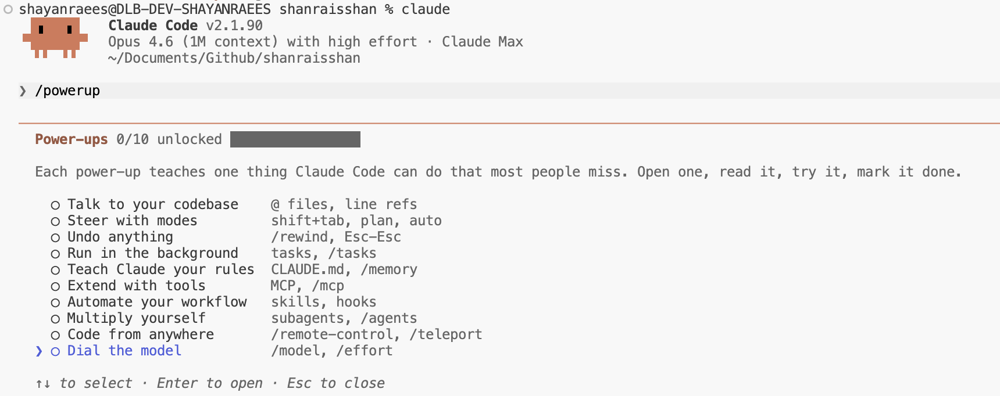

# Power-ups 모범 사례


애니메이션 데모로 Claude Code 기능을 가르치는 인터랙티브 레슨. 각 Power-up은 대부분의 사람들이 놓치는 Claude Code가 할 수 있는 한 가지를 가르칩니다. v2.1.90에서 도입됨.

<table width="100%">
<tr>
<td><a href="../">← Claude Code 모범 사례로 돌아가기</a></td>
<td align="right"></td>
</tr>
</table>

---

## 사용법

```bash
claude
/powerup
```

---

## Power-ups (10개)

<p align="center">
  
</p>

| # | Power-up | 주제 |
|---|----------|------|
| 1 | 코드베이스와 대화하기 | `@` 파일, 줄 참조 |
| 2 | 모드로 방향 설정 | `shift+tab`, 계획, 자동 |
| 3 | 무엇이든 되돌리기 | `/rewind`, `Esc-Esc` |
| 4 | 백그라운드에서 실행 | 태스크, `/tasks` |
| 5 | Claude에게 규칙 가르치기 | `CLAUDE.md`, `/memory` |
| 6 | 도구로 확장 | MCP, `/mcp` |
| 7 | 워크플로우 자동화 | 스킬, 훅 |
| 8 | 자신을 증폭시키기 | 서브에이전트, `/agents` |
| 9 | 어디서나 코딩 | `/remote-control`, `/teleport` |
| 10 | 모델 조정 | `/model`, `/effort` |

---

## 예시: 모델 조정

마지막 Power-up은 애니메이션 데모로 모델 전환과 노력 제어를 가르칩니다.

<p align="center">
  
</p>

<p align="center">
  
</p>

<p align="center">
  
</p>

---

## 출처

- [변경 이력 — v2.1.90](https://code.claude.com/docs/en/changelog)
