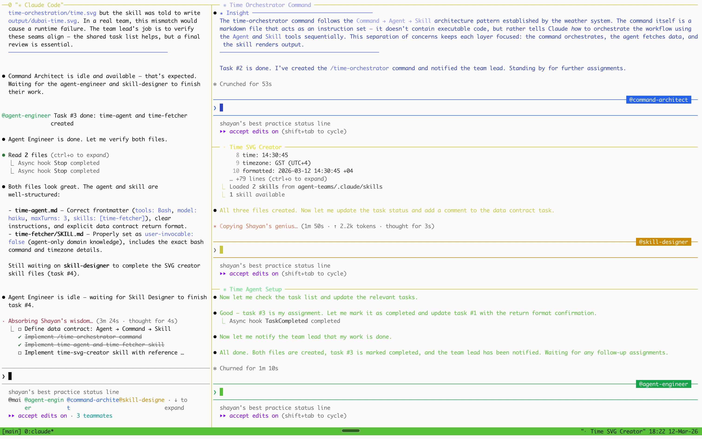

# 에이전트 팀 구현


<table width="100%">
<tr>
<td><a href="../">← Claude Code 모범 사례로 돌아가기</a></td>
<td align="right"></td>
</tr>
</table>

---

<a href="#time-orchestration"></a>

<p align="center">
  
</p>

에이전트 팀은 공유 태스크 목록을 통해 조율되는 **여러 독립적인 Claude Code 세션**을 생성합니다. 하나의 세션 내의 격리된 컨텍스트 포크인 서브에이전트와 달리, 각 팀원은 CLAUDE.md, MCP 서버, 스킬이 자동으로 로드되는 자체 전체 컨텍스트 창을 가집니다.

---

## 

시간 오케스트레이션 워크플로우는 에이전트 팀에 의해 완전히 구축되었습니다. 완성된 제품을 실행하려면:

```bash
cd agent-teams
claude
/time-orchestrator
```

이것은 **명령어 → 에이전트 → 스킬** 파이프라인을 호출합니다: 에이전트는 두바이의 현재 시간을 가져오고, 스킬은 SVG 시간 카드를 `agent-teams/output/dubai-time.svg`에 렌더링합니다.

---

## 

에이전트 팀을 사용하여 날씨 오케스트레이션 워크플로우의 복제본을 만들 수 있습니다 — 이 예시에서 시간 오케스트레이션 워크플로우는 에이전트 팀에 의해 완전히 구축되었습니다.

### 1. [iTerm2](https://iterm2.com/)와 tmux 설치

```bash
brew install --cask iterm2
brew install tmux
```

### 2. iTerm2 → tmux → Claude 시작

```bash
tmux new -s dev
CLAUDE_CODE_EXPERIMENTAL_AGENT_TEAMS=1 claude
```

### 3. 팀 구조로 프롬프트 입력

<a id="time-orchestration"></a>

에이전트 팀을 사용하여 완전한 시간 오케스트레이터 워크플로우를 부트스트랩하기 위해 이 프롬프트를 Claude에 붙여넣으세요:

메인 프롬프트: **[agent-teams-prompt.md](../agent-teams/agent-teams-prompt.md)**

### 팀 조율 흐름

```
┌──────────────────────────────────────────────────────────────┐
│                         리드 (당신)                           │
│       "에이전트 팀을 만들어 시간 오케스트레이션 구축"          │
└──────────────────────────┬───────────────────────────────────┘
                           │ 팀 생성 (모두 병렬)
              ┌────────────┼────────────┐
              ▼            ▼            ▼
   ┌────────────────┐ ┌──────────┐ ┌──────────────┐
   │ 명령어         │ │ 에이전트 │ │ 스킬         │
   │ 아키텍트       │ │ 엔지니어 │ │ 디자이너     │
   │                │ │          │ │              │
   │ agent-teams/   │ │ agent-   │ │ agent-teams/ │
   │ .claude/       │ │ teams/   │ │ .claude/     │
   │ commands/      │ │ .claude/ │ │ skills/      │
   │ time-          │ │ agents/  │ │ time-svg-    │
   │ orchestrator.md│ │ time-    │ │ creator/     │
   │                │ │ agent.md │ │              │
   └───────┬────────┘ └────┬─────┘ └──────┬───────┘
           │               │              │
           ▼               ▼              ▼
   ┌──────────────────────────────────────────────────┐
   │            공유 태스크 목록                       │
   │  ☐ 데이터 계약 합의: {time, tz, formatted}       │
   │  ☐ 명령어는 Agent 도구 사용 (bash 아님)          │
   │  ☐ 에이전트는 time-fetcher 스킬 사전 로드        │
   │  ☐ 스킬은 컨텍스트에서 시간 읽기 (재가져오기 x) │
   │  ☐ 모든 파일은 agent-teams/.claude/ 내에         │
   └──────────────────────────────────────────────────┘
                       │
                       ▼
          ┌──────────────────────────────┐
          │  cd agent-teams && claude    │
          │    /time-orchestrator        │
          │   명령어 → 에이전트 → 스킬  │
          └──────────────────────────────┘
```
