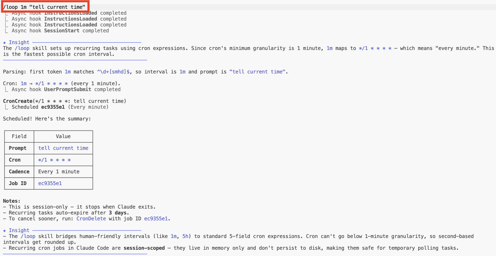
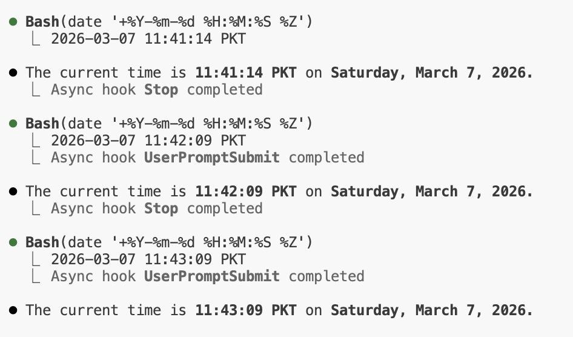

# 예약된 태스크 구현


<table width="100%">
<tr>
<td><a href="../">← Claude Code 모범 사례로 돌아가기</a></td>
<td align="right"></td>
</tr>
</table>

---

<a href="#loop-demo"></a>

`/loop` 스킬은 cron 간격으로 반복 태스크를 예약하는 데 사용됩니다. 아래는 `/loop 1m "tell current time"` — 매분 실행되는 간단한 반복 태스크의 데모입니다.

---

## 루프 데모

### 1. 태스크 예약

<p align="center">
  
</p>

`/loop 1m "tell current time"`은 간격을 파싱하고(`1m` → 매 1분), cron 작업을 생성하고, 일정을 확인합니다. 주요 참고사항:

- Cron의 최소 세분성은 **1분** — `1m`은 `*/1 * * * *`에 매핑됩니다
- 반복 태스크는 **3일 후 자동 만료**됩니다
- 작업은 **세션 범위** — 메모리에만 존재하며 Claude가 종료될 때 중지됩니다
- `cron cancel <job-id>`로 언제든지 취소 가능

---

### 2. 루프 동작 중

<p align="center">
  
</p>

태스크는 매분 실행되어 `date`를 실행하고 현재 시간을 보고합니다. 각 반복은 비동기 **UserPromptSubmit** 및 **Stop** 훅을 트리거합니다 — 이 저장소 전체에서 사운드 알림에 사용되는 동일한 훅 시스템입니다.

---

## 

```bash
$ claude
> /loop 1m "tell current time"
> /loop 5m /simplify
> /loop 10m "check deploy status"
```

---

## 

`/loop`는 내장 Claude Code 스킬 — 별도 설정이 필요하지 않습니다. 반복 일정을 관리하기 위해 내부적으로 cron 도구(`CronCreate`, `CronList`, `CronDelete`)를 사용합니다.
